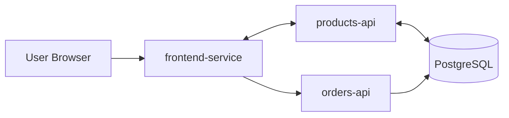

# DevOps Microservices Platform

Hands-on DevOps portfolio project built around a multi-repository microservices system.  
This repository is the orchestration layer used to run, test, secure, and publish all services together.

## DevOps Skills Demonstrated
| Area | Tools / Practices |
|---|---|
| Version Control | Git, GitHub, Git Flow (main/develop/feature/release/hotfix), protected branches, pull request workflow |
| Containerization | Docker, multi-stage Dockerfiles, Docker Compose, Docker Hub repositories, image tagging strategy |
| CI/CD | Jenkins, Jenkinsfiles per service, shared libraries, webhook triggers, Build/Dev/Staging/Prod pipelines |
| Infrastructure as Code | Terraform modules, workspaces (dev/staging/prod), `.tfvars`, local state management, Terraform outputs for CI/CD |
| Kubernetes | Deployments, ClusterIP and NodePort Services, ConfigMaps, Secrets, namespaces, PersistentVolumes and PVCs |
| Security and Quality | Trivy image scanning, linting, unit and integration testing, static analysis stage in pipeline |
| Automation | Makefile-based workflows for clone/build/up/test/push/scan/clean across all microservices |
| Validation and Release Flow | End-to-end promotion from code commit to production with environment verification and image version checks |

## System Architecture


## Repositories
This project is split into multiple repos:
- `frontend-service`: https://github.com/cesarnunezh/frontend-service
- `order-service`: https://github.com/cesarnunezh/order-service
- `product-service`: https://github.com/cesarnunezh/product-service
- `database`: https://github.com/cesarnunezh/database

## Quick Start
### 1) Clone this orchestration repo
```bash
git clone https://github.com/cesarnunezh/DevOpsProject.git
cd DevOpsProject
```

### 2) Clone all microservice repos
```bash
make clone-services
```

### 3) Build and run
```bash
make build ENV=dev
make up ENV=dev
```

Service endpoints:
- Frontend: `http://localhost:3000`
- Products API: `http://localhost:8070/products`
- Orders API: `http://localhost:8050/orders`

## Common Commands
```bash
make logs ENV=dev
make test
make push ENV=prod
make scan ENV=prod
make down
make clean ENV=dev
```

## Kubernetes Deployment
Kubernetes manifests live under `k8s/` and are organized as a reusable `base` plus `dev`, `staging`, and `prod` overlays.

The stateless services use a blue-green deployment model:
- `frontend-service-blue` / `frontend-service-green`
- `products-api-blue` / `products-api-green`
- `orders-api-blue` / `orders-api-green`

The stable ClusterIP and NodePort Services keep the original service names and switch traffic between the `blue` and `green` deployments by changing their selectors after the new color is healthy. `database-service` remains a single deployment backed by a PVC.

Only the database uses the repo default `dev-terraform` mutable dev tag on first apply. The stateless services are created at `0` replicas and should be promoted with a real Jenkins `IMAGE_URI` or a known-good image that already exists in the registry.

Ingress is also configured per environment using the cluster's `nginx` ingress class:
- `dev.devops.local`
- `staging.devops.local`
- `prod.devops.local`

Ingress routes:
- `/` -> `frontend-service`
- `/products` -> `products-api`
- `/orders` -> `orders-api`

Render an environment locally:
```bash
kubectl kustomize k8s/overlays/dev
kubectl kustomize k8s/overlays/staging
kubectl kustomize k8s/overlays/prod
```

Bootstrap an environment once:
```bash
bash scripts/k8s-deploy.sh dev --bootstrap
bash scripts/k8s-deploy.sh staging --bootstrap
bash scripts/k8s-deploy.sh prod --bootstrap
```

Environment namespaces:
- `devops-dev`
- `devops-staging`
- `devops-prod`

NodePort access:
- Frontend: `http://<minikube-ip>:30080`
- Products API: `http://<minikube-ip>:30070/products`
- Orders API: `http://<minikube-ip>:30050/orders`
- Staging frontend/API NodePorts: `31080`, `31070`, `31050`
- Prod frontend/API NodePorts: `32080`, `32070`, `32050`

Ingress access after adding local host mappings:
- `http://dev.devops.local`
- `http://staging.devops.local`
- `http://prod.devops.local`

Jenkins deploys use the immutable `IMAGE_URI` generated by the shared library as the primary deployment target. The deploy scripts verify that image first, fall back to the mutable `MUTABLE_TAG` only if needed, deploy the inactive color, wait for rollout success, switch the stable Services to that color, and then scale the old color down to zero. The full overlay is applied only during explicit bootstrap so normal per-service deploys do not reset other services back to `blue`. If rollout fails, the target color is scaled back to `0` so failed first attempts do not leave broken pods behind.

Local Postgres storage paths are documented in [`k8s/storage/README.md`](./k8s/storage/README.md).

Manual blue-green migration demo:
```bash
bash scripts/migrate-blue-green.sh dev frontend-service cesarnunezh/frontend-service:latest
bash scripts/migrate-blue-green.sh dev products-api cesarnunezh/products-api:latest --keep-old
```

The standalone migration script is intended for demos and screenshots. It prints the current active color, target color, rollout checkpoints, service selector switch, and final pod state for a single stateless service at a time.

## Deployment Strategy
This project uses blue-green deployment for the stateless services and a single-instance deployment for PostgreSQL.

Blue-green flow:
- Bootstrap the environment once to create namespaces, config, services, ingress, and storage.
- Jenkins builds and pushes an immutable image tag for a service.
- The deployment script resolves the immutable `IMAGE_URI`, falling back to the mutable tag only when needed.
- The inactive color (`blue` or `green`) is scaled up with the new image.
- Kubernetes waits for rollout success before traffic changes.
- The stable ClusterIP and NodePort Services switch their selectors to the new color.
- The old color is scaled down to `0`.

Database strategy:
- `database-service` stays single-instance because it uses one writable persistent volume claim.
- It is updated in place after the image is validated.

Why this strategy:
- It provides safer application rollouts than in-place updates for the stateless services.
- It gives clear rollout evidence through `kubectl rollout status`.
- It allows fast rollback by switching the stable Services back to the previous color.

## Validation Commands
Render manifests:
```bash
kubectl kustomize k8s/overlays/dev
kubectl kustomize k8s/overlays/staging
kubectl kustomize k8s/overlays/prod
```

Bootstrap environments:
```bash
bash scripts/k8s-deploy.sh dev --bootstrap
bash scripts/k8s-deploy.sh staging --bootstrap
bash scripts/k8s-deploy.sh prod --bootstrap
```

Check namespaces, pods, services, and ingress:
```bash
kubectl get ns
kubectl get pods -n devops-dev
kubectl get pods -n devops-staging
kubectl get pods -n devops-prod
kubectl get svc -n devops-dev
kubectl get svc -n devops-staging
kubectl get svc -n devops-prod
kubectl get ingress -n devops-dev
kubectl get ingress -n devops-staging
kubectl get ingress -n devops-prod
```

Check rollout status:
```bash
kubectl rollout status deployment/database-service -n devops-dev
kubectl rollout status deployment/frontend-service-green -n devops-dev
kubectl rollout status deployment/products-api-green -n devops-dev
kubectl rollout status deployment/orders-api-green -n devops-dev
```

Host mapping for local ingress demo:
```text
<minikube-ip> dev.devops.local
<minikube-ip> staging.devops.local
<minikube-ip> prod.devops.local
```

## Evidence and Artifacts
- Docker Hub images:
  - https://hub.docker.com/repository/docker/cesarnunezh/database-service/general
  - https://hub.docker.com/repository/docker/cesarnunezh/frontend-service/general
  - https://hub.docker.com/repository/docker/cesarnunezh/orders-api/general
  - https://hub.docker.com/repository/docker/cesarnunezh/products-api/general
- Security scan reports:
  - [`./security-reports/database-service.trivy.txt`](./security-reports/database-service.trivy.txt)
  - [`./security-reports/frontend-service.trivy.txt`](./security-reports/frontend-service.trivy.txt)
  - [`./security-reports/orders-api.trivy.txt`](./security-reports/orders-api.trivy.txt)
  - [`./security-reports/products-api.trivy.txt`](./security-reports/products-api.trivy.txt)

## Additional Documentation
- Full project notes and phase deliverables: `./homework.md`
