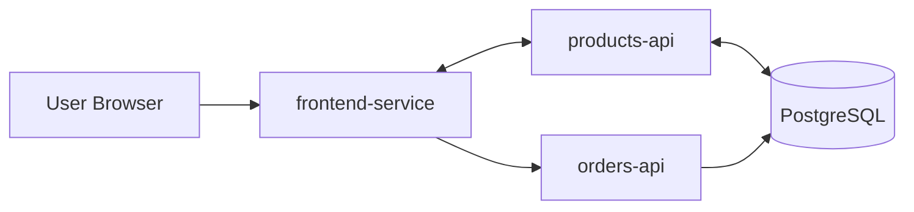

# DevOps Microservices Platform

Hands-on DevOps portfolio project built around a multi-repository microservices system.  
This repository is the orchestration layer used to run, test, secure, and publish all services together.

## DevOps Skills Demonstrated
| Area | Tools / Practices |
|---|---|
| Version Control | Git, GitHub, Git Flow (main/develop/feature/release/hotfix), protected branches, pull request workflow |
| Containerization | Docker, multi-stage Dockerfiles, Docker Compose, Docker Hub repositories, image tagging strategy |
| CI/CD | Jenkins, Jenkinsfiles per service, shared libraries, webhook triggers, Build/Dev/Staging/Prod pipelines |
| Infrastructure as Code | Terraform modules, workspaces (dev/staging/prod), `.tfvars`, local state management, Terraform outputs for CI/CD |
| Kubernetes | Deployments, ClusterIP and NodePort Services, ConfigMaps, Secrets, namespaces, PersistentVolumes and PVCs |
| Security and Quality | Trivy image scanning, linting, unit and integration testing, static analysis stage in pipeline |
| Automation | Makefile-based workflows for clone/build/up/test/push/scan/clean across all microservices |
| Validation and Release Flow | End-to-end promotion from code commit to production with environment verification and image version checks |

## System Architecture


## Repositories
This project is split into multiple repos:
- `frontend-service`: https://github.com/cesarnunezh/frontend-service
- `order-service`: https://github.com/cesarnunezh/order-service
- `product-service`: https://github.com/cesarnunezh/product-service
- `database`: https://github.com/cesarnunezh/database

## Quick Start
### 1) Clone this orchestration repo
```bash
git clone https://github.com/cesarnunezh/DevOpsProject.git
cd DevOpsProject
```

### 2) Clone all microservice repos
```bash
make clone-services
```

### 3) Build and run
```bash
make build ENV=dev
make up ENV=dev
```

Service endpoints:
- Frontend: `http://localhost:3000`
- Products API: `http://localhost:8070/products`
- Orders API: `http://localhost:8050/orders`

## Common Commands
```bash
make logs ENV=dev
make test
make push ENV=prod
make scan ENV=prod
make down
make clean ENV=dev
```

## Evidence and Artifacts
- Docker Hub images:
  - https://hub.docker.com/repository/docker/cesarnunezh/database-service/general
  - https://hub.docker.com/repository/docker/cesarnunezh/frontend-service/general
  - https://hub.docker.com/repository/docker/cesarnunezh/orders-api/general
  - https://hub.docker.com/repository/docker/cesarnunezh/products-api/general
- Security scan reports:
  - [`./security-reports/database-service.trivy.txt`](./security-reports/database-service.trivy.txt)
  - [`./security-reports/frontend-service.trivy.txt`](./security-reports/frontend-service.trivy.txt)
  - [`./security-reports/orders-api.trivy.txt`](./security-reports/orders-api.trivy.txt)
  - [`./security-reports/products-api.trivy.txt`](./security-reports/products-api.trivy.txt)

## Additional Documentation
- Full project notes and phase deliverables: `./homework.md`
