# DevOps Final Project - Winter 2026

**Student:** César Núñez  
**Date:** 03/11/2026

# Phase 1: Repository Setup and Version Control
**Objective:** Establish a professional version control foundation that supports collaborative development, automated deployments, and code quality standards.

**Deliverables:** 
- Four properly structured Git repositories
- Documentation explaining your Git workflow and branching strategy
- Screenshots demonstrating:
  - Initial setup of main and develop branches
    - database: 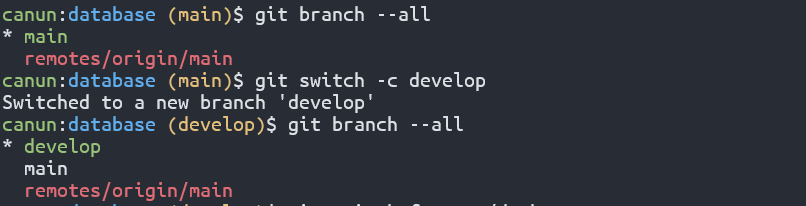
    - frontend-service: 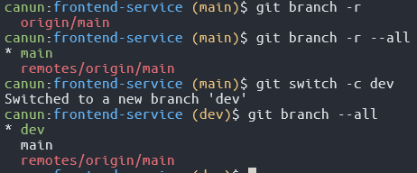
    - order-service: 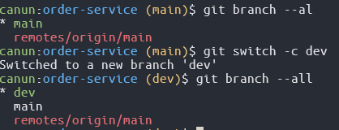
    - product-service: 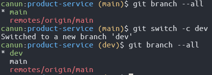
  - Complete feature development workflow (from branch creation to merge)
    - database: 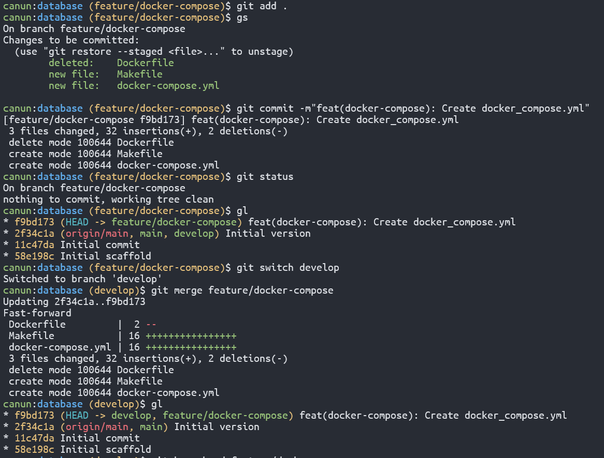
    - frontend-service: 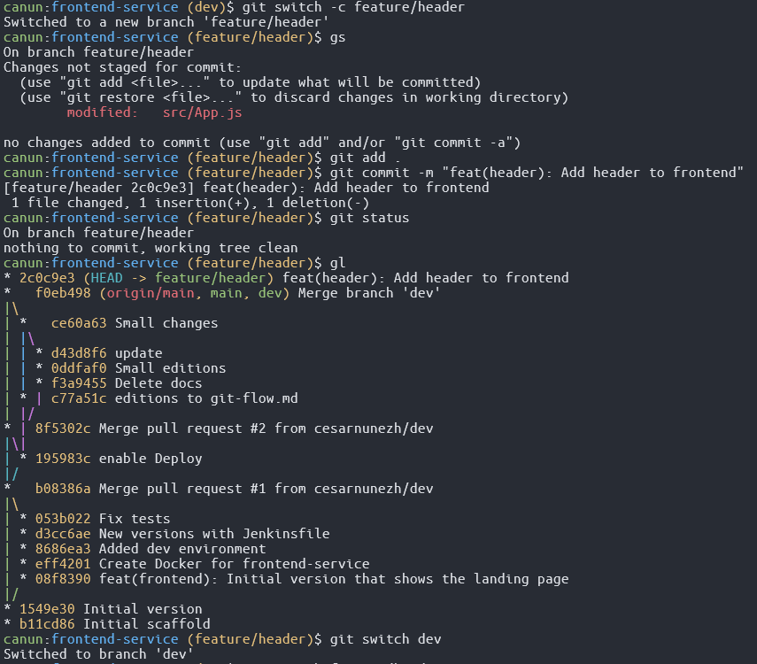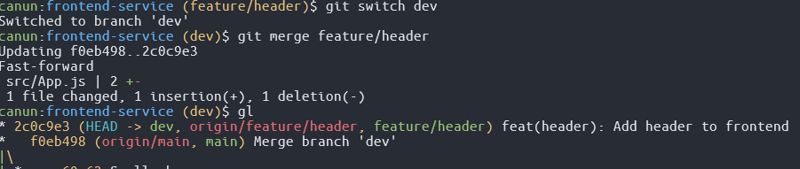
    - order-service: 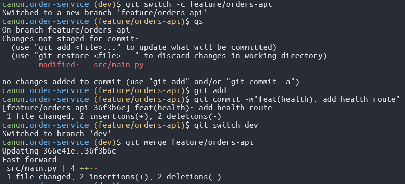
    - product-service: 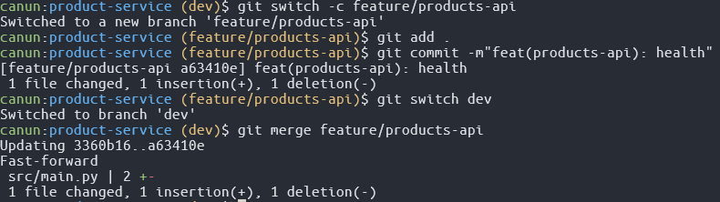
  - Complete release workflow (from develop to main)
    - database: 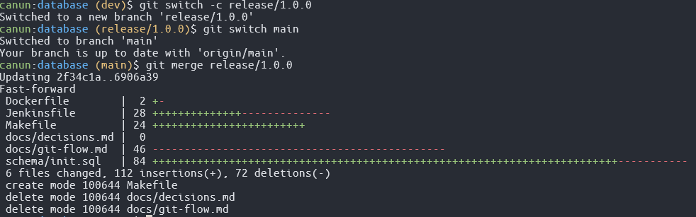
    - frontend-service: 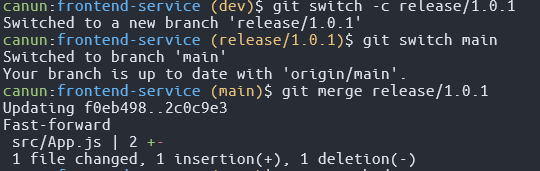
    - order-service: 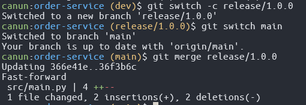
    - product-service: 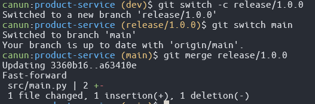
  - Complete hotfix workflow (from main back to main and develop)
    - database: 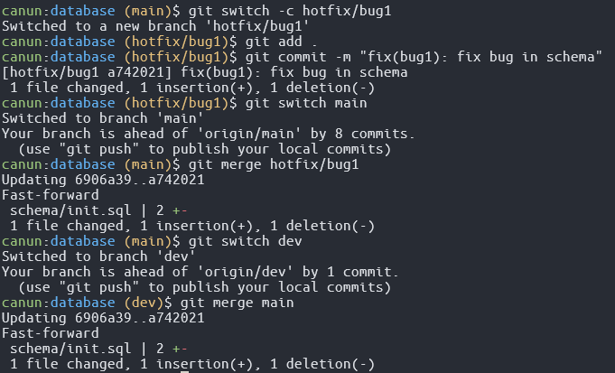
    - frontend-service: 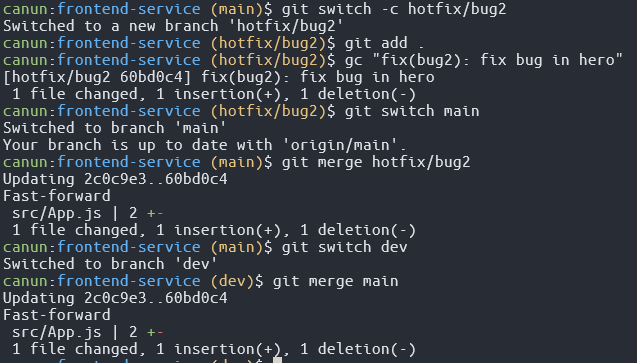
    - order-service: 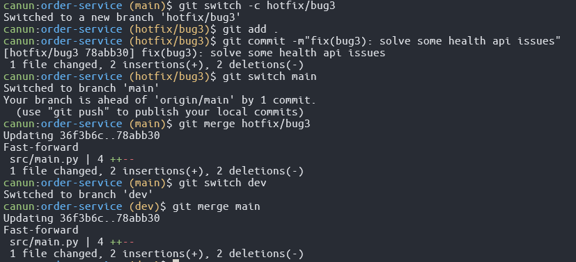
    - product-service: 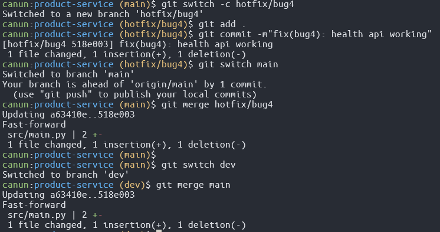
  - How all branch types interact in the Git Flow model
    ```mermaid
      flowchart TD

      develop --> feature
      feature -->|PR merge| develop

      develop --> release
      release -->|merge| main
      release -->|merge back| develop

      main --> hotfix
      hotfix -->|merge| main
      hotfix -->|merge back| develop
    ```
- Documentation explaining your design decisions and rationale: available here:  [`docs/git-flow.md`](./docs/git-flow.md)

# Phase 2: Containerization with Docker
**Deliverables:** 
- Dockerfiles for all services
    - database: Available [here](https://github.com/cesarnunezh/database/blob/main/Dockerfile)
    - frontend-service: Available [here](https://github.com/cesarnunezh/frontend-service/blob/main/Dockerfile)
    - order-service: Available [here](https://github.com/cesarnunezh/order-service/blob/main/Dockerfile)
    - product-service: Available [here](https://github.com/cesarnunezh/product-service/blob/main/Dockerfile)
- Docker Compose configuration
  ```yaml
  services:

  web-dev:
    build:
      context: frontend-service
      target: dev
    image: cesarnunezh/frontend-service:dev
    ports:
      - "3000:3000"
    volumes:
      - ./frontend-service:/app
      - /app/node_modules
    env_file: .env
    profiles:
      - dev

  web:
    build:
      context: frontend-service
      target: production
    image: cesarnunezh/frontend-service:prod
    ports:
      - "3000:80"
    env_file: .env
    profiles:
      - prod

  database:
    build:
      context: database
      target: database
    image: cesarnunezh/database-service:latest
    restart: unless-stopped
    env_file: .env
    ports:
      - "5432:5432"
    volumes:
      - postgres_data:/var/lib/postgresql/data
    healthcheck:
      test: ["CMD-SHELL", "pg_isready -U postgres -d database"]
      interval: 10s
      timeout: 5s
      retries: 5
      start_period: 10s
    networks:
      - app-network

  orders-api:
    build: 
      context: order-service
      target: runtime
    image: cesarnunezh/orders-api:latest
    ports:
      - "8050:8050"
    env_file:
      - .env
    depends_on:
      database:
        condition: service_healthy
    networks:
      - app-network

  products-api:
    build: 
      context: product-service
      target: runtime
    image: cesarnunezh/products-api:latest
    ports:
      - "8070:8070"
    env_file:
      - .env
    depends_on:
      database:
        condition: service_healthy
    networks:
      - app-network

  networks:
    app-network:

  volumes:
    postgres_data:
  ```
- Container security scan reports: available [here](./security-reports/)
- Screenshot showing all images successfully pushed to Docker Hub: 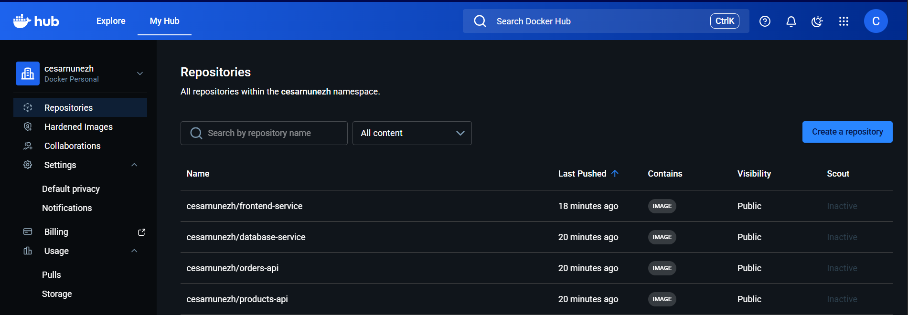
- Docker Hub repository URLs for each service:
    - database: https://hub.docker.com/repository/docker/cesarnunezh/database-service/general
    - frontend-service: https://hub.docker.com/repository/docker/cesarnunezh/frontend-service/general
    - order-service: https://hub.docker.com/repository/docker/cesarnunezh/orders-api/general
    - product-service: https://hub.docker.com/repository/docker/cesarnunezh/products-api/general

# Phase 3: CI/CD Pipeline with Jenkins
**Deliverables:**
- Screenshots of Jenkins server with pipelines configured 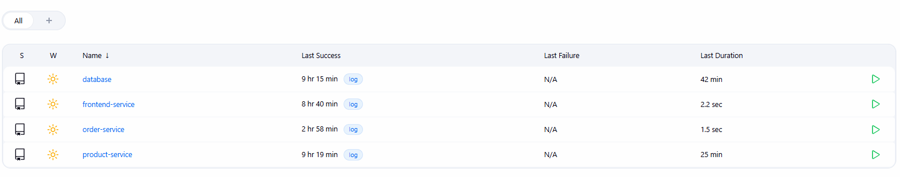
      - database: 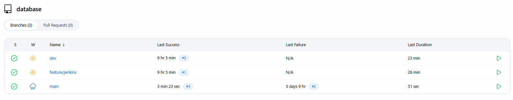
      - frontend-service: 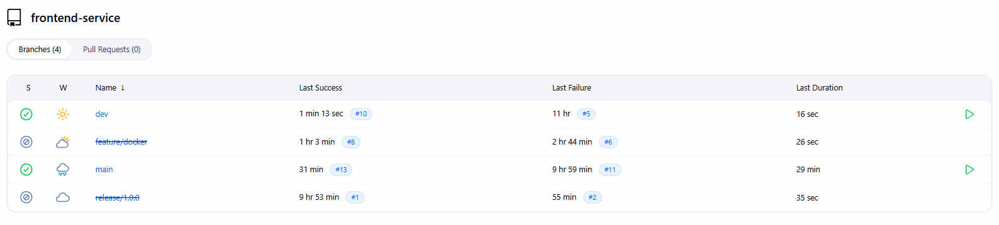
      - order-service: 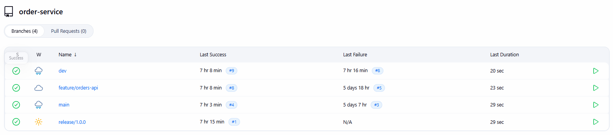
      - product-service: 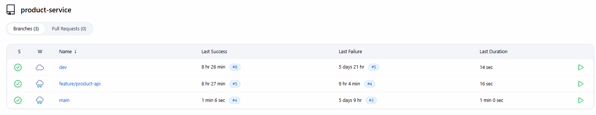
- Jenkinsfiles for all services:
  - Shared folder: Available [here](https://github.com/cesarnunezh/DevOpsProject/tree/main/vars)
  - database: Available [here](https://github.com/cesarnunezh/database/blob/main/Jenkinsfile)
  - frontend-service: Available [here](https://github.com/cesarnunezh/frontend-service/blob/main/Jenkinsfile)
  - order-service: Available [here](https://github.com/cesarnunezh/order-service/blob/main/Jenkinsfile)
  - product-service: Available [here](https://github.com/cesarnunezh/product-service/blob/main/Jenkinsfile)
- Screenshots of pipeline executions for each environment (Build, Dev, Staging, Prod):
    - Build/Dev: 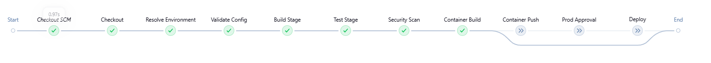
    - Staging: 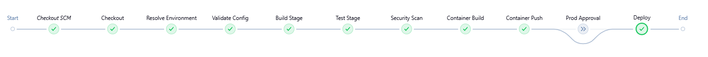
    - Prod: 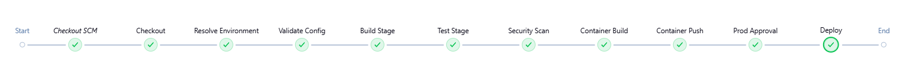

# Phase 4: Infrastructure as Code with Terraform
**Deliverables:**
- Terraform modules and configurations: Available [here](https://github.com/cesarnunezh/DevOpsProject/tree/main/terraform/modules)
- State management setup: Available [here](https://github.com/cesarnunezh/DevOpsProject/tree/main/terraform)
- Screenshots showing:
  - Terraform plan output for each environment
    - Dev: Available [here](https://github.com/cesarnunezh/DevOpsProject/tree/main/images/phase4/plan_dev.txt)
    - Staging: Available [here](https://github.com/cesarnunezh/DevOpsProject/tree/main/images/phase4/plan_staging.txt)
    - Prod: Available [here](https://github.com/cesarnunezh/DevOpsProject/tree/main/images/phase4/plan_prod.txt)
  - Successful terraform apply results
    - Dev: Available [here](https://github.com/cesarnunezh/DevOpsProject/tree/main/images/phase4/apply_dev.txt)
    - Staging: Available [here](https://github.com/cesarnunezh/DevOpsProject/tree/main/images/phase4/apply_staging.txt)
    - Prod: Available [here](https://github.com/cesarnunezh/DevOpsProject/tree/main/images/phase4/apply_prod.txt)
  - Running Minikube cluster and local resources 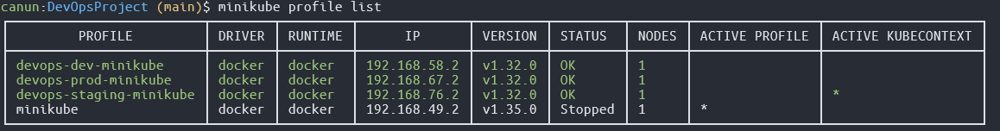
  - Terraform outputs that will be used by Jenkins
    - Dev: 
    ```
    docker_network_name = "devops-dev-network"
    docker_registry_namespace = "cesarnunezh"
    environment = "dev"
    image_repository_prefix = "cesarnunezh"
    jenkins_port = 8080
    jenkins_url = "http://localhost:8080"
    kubernetes_namespace = "dev"
    minikube_cluster_ip = ""
    minikube_kubeconfig_context = "devops-dev-minikube"
    minikube_kubeconfig_path = "/home/canun/.kube/config"
    minikube_profile = "devops-dev-minikube"
    name_prefix = "devops-dev"
    postgres_connection_string = <sensitive>
    postgres_db = "database"
    postgres_host = "localhost"
    postgres_port = 5432
    service_base_urls = {
      "frontend" = "http://localhost:3000"
      "jenkins" = "http://localhost:8080"
      "orders" = "http://localhost:8050"
      "products" = "http://localhost:8070"
    }
    ```
    - Staging: 
    ```
    docker_network_name = "devops-staging-network"
    docker_registry_namespace = "cesarnunezh"
    environment = "staging"
    image_repository_prefix = "cesarnunezh"
    jenkins_port = 8081
    jenkins_url = "http://localhost:8081"
    kubernetes_namespace = "staging"
    minikube_cluster_ip = ""
    minikube_kubeconfig_context = "devops-staging-minikube"
    minikube_kubeconfig_path = "/home/canun/.kube/config"
    minikube_profile = "devops-staging-minikube"
    name_prefix = "devops-staging"
    postgres_connection_string = <sensitive>
    postgres_db = "database"
    postgres_host = "localhost"
    postgres_port = 5433
    service_base_urls = {
      "frontend" = "http://localhost:3100"
      "jenkins" = "http://localhost:8081"
      "orders" = "http://localhost:8150"
      "products" = "http://localhost:8170"
    }    
    ```
    - Prod: 
    ```
    docker_network_name = "devops-prod-network"
    docker_registry_namespace = "cesarnunezh"
    environment = "prod"
    image_repository_prefix = "cesarnunezh"
    jenkins_port = 8082
    jenkins_url = "http://localhost:8082"
    kubernetes_namespace = "prod"
    minikube_cluster_ip = ""
    minikube_kubeconfig_context = "devops-prod-minikube"
    minikube_kubeconfig_path = "/home/canun/.kube/config"
    minikube_profile = "devops-prod-minikube"
    name_prefix = "devops-prod"
    postgres_connection_string = <sensitive>
    postgres_db = "database"
    postgres_host = "localhost"
    postgres_port = 5434
    service_base_urls = {
      "frontend" = "http://localhost:3200"
      "jenkins" = "http://localhost:8082"
      "orders" = "http://localhost:8250"
      "products" = "http://localhost:8270"
    }
    ```

# Phase 5: Kubernetes Deployment
**Deliverables:**
- Kubernetes manifests for all services: Available [here](https://github.com/cesarnunezh/DevOpsProject/tree/main/k8s)
- Screenshots showing:
  - Running pods in different namespaces: 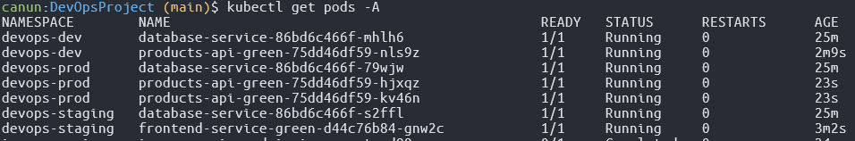
  - Services and ingress configuration: 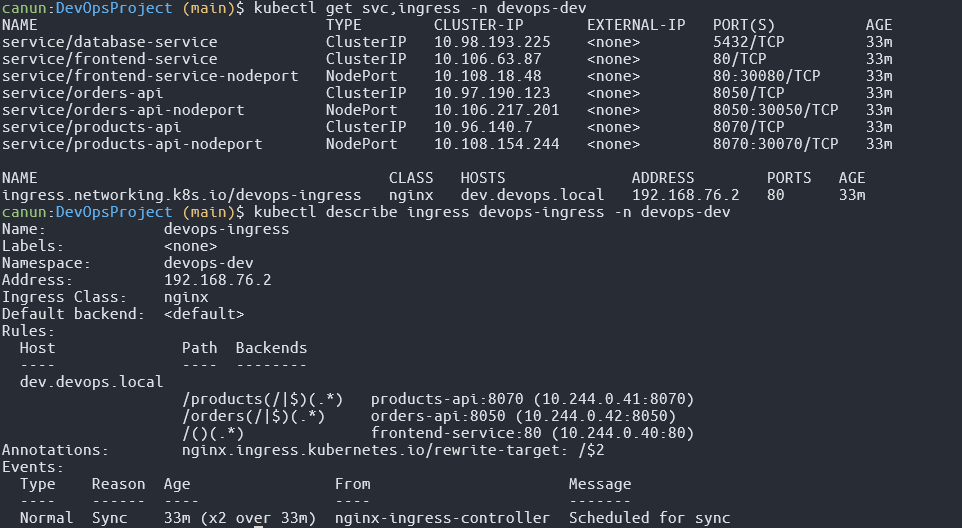
  - Successful deployment rollout 
    - Before: 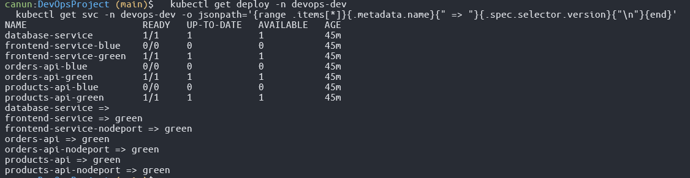
    - After: 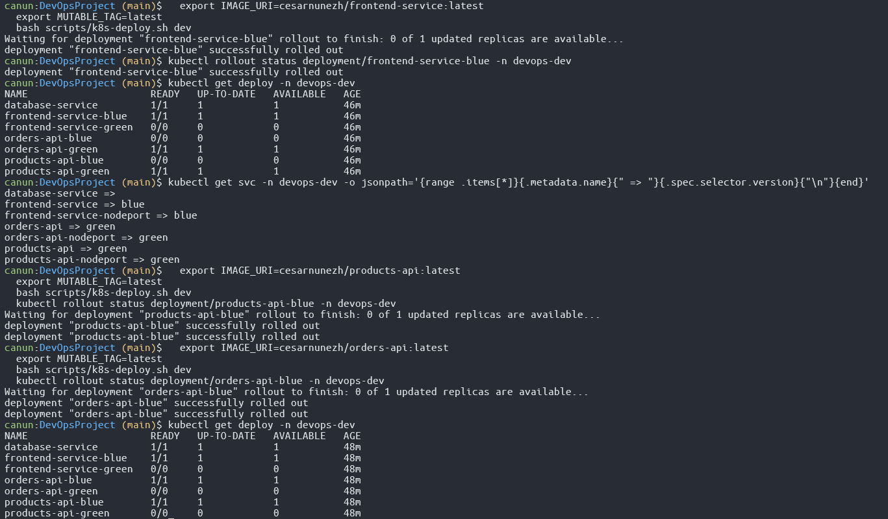
- Documentation explaining your deployment strategy (rolling updates, blue-green, or canary)

# Phase 6: Integration Validation
**Objective:** Demonstrate that all components work together as a complete DevOps pipeline.

**Deliverables:**
- Screenshots or screen recording showing the complete flow from code commit to production
- Evidence of successful deployments in all environments:
  - kubectl output showing running pods
  - Application accessible via browser/API
  - Correct image tags in each environment
- Brief report summarizing any challenges faced and how they were resolved
